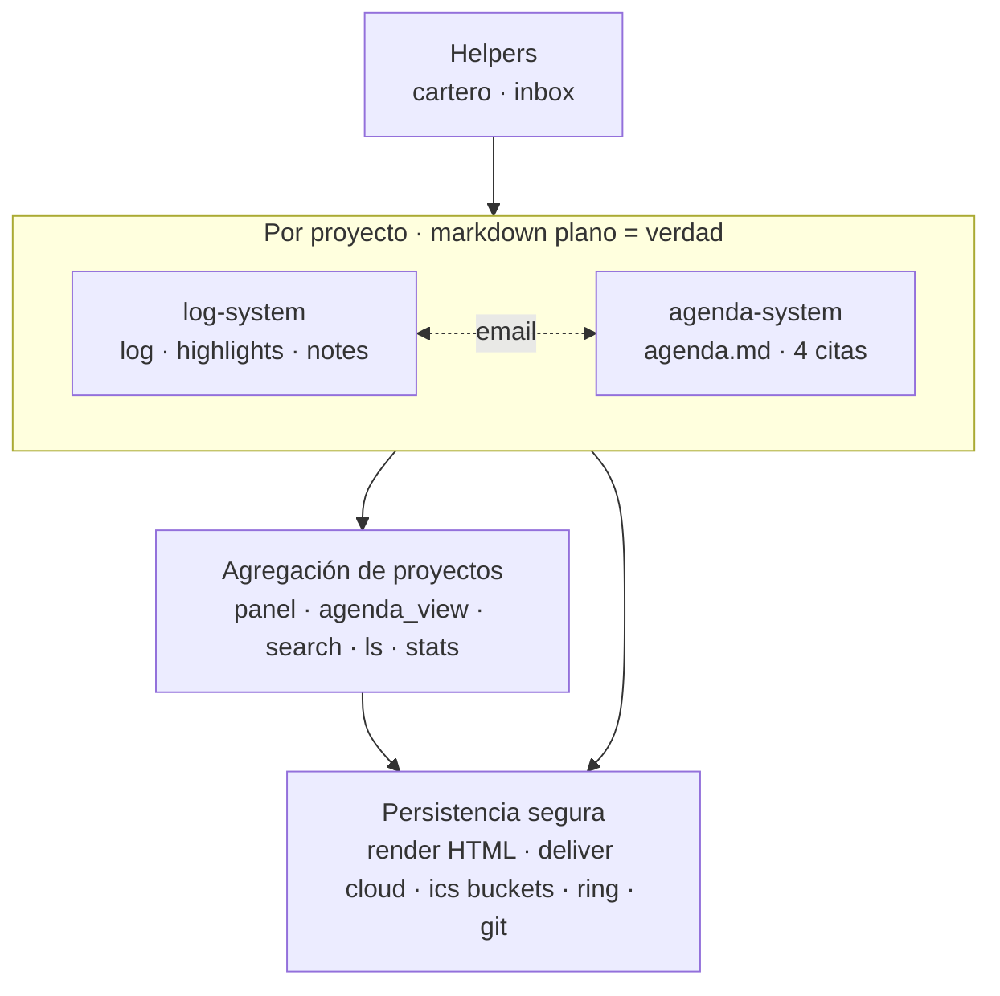

# MODULES.md

Mapa de módulos del paquete y sus dependencias internas. Sirve para guiar la limpieza/simplificación del CLI sin perder de vista qué encaja con qué.

Última auditoría: 2026-05-15. Total: 48 módulos en `core/` + `orbit.py` (CLI) + `orbit_ring_daemon.py` ≈ 28 200 líneas.

---

## 1. Vista esencial

Cuatro bloques. Acoplamientos:

- **`log-system` ↔ `agenda-system`** comparten una sola dependencia cruzada en escritura: `email.py` (captura email → entrada de log + opcional evento en agenda con `--ev`).
- Dentro de `log-system`, `highlights` y `notes` registran su operación llamando a `log.add_orbit_entry` — no son 100 % independientes entre sí.
- `cronograma` (Gantt) **vive aparte** de las 4 citas; encaja en log-system como md propio del proyecto pero su modelo es independiente.

---

## 2. Vista por capas (data flow detallado)

```mermaid
graph TB
    subgraph EXT_IN [Fuentes externas]
        MAIL[Mail.app · Outlook · .eml]
        SLACK[Slack]
        ICSIN[.ics externo]
    end
    subgraph EXT_OUT [Sinks externos]
        CALSUB[(Apple Calendar<br/>read-only subscriber)]
        REMAPP[(Reminders.app)]
        CLOUD[(OneDrive · GDrive)]
        PROMPT[(Shell prompt 📬N)]
    end

    subgraph FEED [A · Feeds entrantes]
        cartero["cartero · 958"]
        email["email · 1098"]
        ics["ics · 771"]
        inbox["inbox · 290"]
    end

    subgraph TRUTH [B · md = verdad]
        log["log · 364"]
        highlights["highlights · 457"]
        notes["notes · 474"]
        agenda_cmds["agenda_cmds · 2245 ⚠️"]
        tasks["tasks · 318"]
        project["project · 631"]
        archive["archive · 328"]
        cronograma["cronograma · 1830 ❓"]
        tracked["tracked · 209"]
    end

    subgraph EMIT [C · Emisores salientes]
        render["render · 713"]
        deliver["deliver · 205"]
        cloudsync["cloudsync · 240"]
        cloud_imgs["cloud_imgs · 278"]
        recloud["recloud · 230"]
        ics_share["ics_share · 680"]
        ring_export["ring_export · 572"]
        ring["ring · 377 (helpers + dormant-flag path)"]
        daemon["orbit_ring_daemon · 288"]
        gsync["gsync · 2880 ⚠️"]
        calsync["calsync · 793"]
        calendar_sync["calendar_sync · 247"]
    end

    subgraph VIEW [D · Vistas / dashboards]
        panel["panel · 433 → panel.md"]
        agenda_view["agenda_view · 1086 → agenda+cal"]
        project_view["project_view · 268"]
    end

    subgraph META [E · Búsqueda · meta]
        search["search · 231"]
        ls["ls · 135"]
        stats["stats · 468"]
        doctor["doctor · 758"]
        reorganize["reorganize · 344"]
    end

    subgraph FOUND [F · Foundation]
        config["config"]
        dateparse["dateparse"]
        opn["open"]
        hooks["hooks · 464"]
        commit["commit · 707"]
        shell["shell · 346"]
        claude["claude · 148"]
        clip["clip · 195"]
        history["history · 106"]
        undo["undo · 187"]
        setup["setup · 298"]
    end

    MAIL --> cartero --> PROMPT
    SLACK --> cartero
    MAIL --> email
    ICSIN --> ics

    email --> log
    email --> agenda_cmds
    inbox --> log
    ics --> agenda_cmds

    log --> notes
    log --> highlights
    project --> log
    agenda_cmds --> tasks
    archive --> log

    agenda_cmds --> ring_export --> daemon --> REMAPP
    agenda_cmds --> ring -.legacy.-> REMAPP
    agenda_cmds --> ics_share --> CLOUD --> CALSUB
    agenda_cmds --> calsync --> gsync
    agenda_cmds --> calendar_sync
    log --> render --> CLOUD
    log --> deliver --> CLOUD
    notes --> deliver
    cloudsync --> CLOUD
    cloud_imgs --> CLOUD
    recloud --> CLOUD

    log --> panel
    agenda_cmds --> panel
    agenda_cmds --> agenda_view
    project --> project_view

    log --> search
    project --> search
    log --> stats
    project --> ls

    commit --> hooks
    hooks --> ring_export
    hooks --> ics_share
    hooks --> render
```

⚠️ = monstruos (>1500 ℓ), candidatos a partir. ❓ = sospechosos de duplicidad o dormancia.

---

## 3. Outline conceptual → módulos reales

| Nº | Concepto | Módulos | Notas |
|---|---|---|---|
| 0.0 | Mail → log/event | `email` (1098) | Captura Apple Mail / Outlook / .eml. `--ev` también escribe agenda → cubre 2.1 a la vez. |
| 0.2 | Mail/Slack → notif. al prompt | `cartero` (958) | Solo escribe `[📬N]` en el shell. Independiente del log. |
| 1   | Log + hl + notes + cloud | `log` `highlights` `notes` + `archive` | `highlights` y `notes` escriben en `log` (no son independientes). |
| 1.1a | md propios en repo | `notes` | ✓ |
| 1.1b | pesados a cloud | `deliver` `cloudsync` `cloud_imgs` `recloud` | 4 módulos para "copiar a `cloud_root`". Fusión clara. |
| 1.1c | links externos md / others | (convención de log; sin módulo dedicado) | Resuelto en `log` + `open`. |
| 1.3 | render HTML mirror | `render` (713) | ✓ |
| 2   | agenda.md (4 citas) | `agenda_cmds` (2245) `tasks` `agenda_view` (1086) | `agenda_cmds` es el corazón y el módulo más grande. |
| 2.1 | input email / ics | `email` `ics` | ✓ |
| 2.2.0 | dash → panel + agenda + calendar md | `panel` (panel.md) + `agenda_view` (agenda+cal) | ✓ |
| 2.2.1 | render HTML agenda | `render` | mismo módulo que 1.3 |
| 2.2.2 | .ics buckets + Calendar subscribe | `ics` `ics_share` + `hooks` | Calendar.app es solo subscriber (read-only) desde v0.33. |
| 2.2.3 | reminders → daemon → Reminders.app | `ring_export` `orbit_ring_daemon` (+ `ring` legacy dormante) | v0.37 con EventKit. `reminders.py` ya borrado (v0.38). |
| 3   | log + agenda en project | `project` `project_view` `search` `ls` `stats` | ✓ |
| 3.3.1 | Obsidian editor; md = verdad | (`editor` en `orbit.json`) | ✓ |

### Bloques que existen y no aparecían en el outline

| Bloque | Módulos | Decisión a tomar |
|---|---|---|
| Cronograma (Gantt + dependencias) | `cronograma` (1830) + `crono` CLI | ¿Fusionar con agenda, dejar aparte, congelar? |
| Captura rápida en `inbox.md` | `inbox` (290) | Encaja en (1) como input ligero. |
| Hooks + commit | `hooks` (464) + `commit` (707) + `hooks_catalog.json` | Foundation transversal que dispara los emisores. |
| Migraciones legacy | ~~`migrate` `tracked_migrate`~~ ✅ borrados (2026-05-15); quedan `reorganize` (344) `tracked` (209) | Auditar qué sigue vivo. |
| ~~Importador Evernote~~ | ~~`importer` (478)~~ | ✅ borrado (2026-05-15) |
| Meta CLI | `doctor` (758) `undo` (187) `history` (106) `setup` (298) `claude` (148) `clip` (195) `shell` (346) | Foundation, simplificable. |

---

## 4. Solapamientos y candidatos a simplificación

1. **Tres caminos a Google/Calendar** — `gsync` (2880) + `calsync` (793) + `calendar_sync` (247). Según `DEPENDENCIES.md` Calendar.app es read-only subscriber desde v0.33. **Mayor potencial de borrado del repo.**
2. ~~**Dos caminos a Reminders.app** — `reminders.py` (AppleScript directo, legacy) vs `ring_export+daemon` (EventKit, v0.35). `reminders.py` parece dormante.~~ ✅ **Resuelto** (2026-05-15): `reminders.py` borrado. Queda `ring.py` (520 ℓ) marcado como dormante en CLAUDE.md desde v0.37 — siguiente candidato.
3. **Cuatro módulos cloud** — `deliver` + `cloudsync` + `recloud` + `cloud_imgs`. Todos giran sobre "copiar a `cloud_root`". Fusionables en un único `cloud.py`.
4. **`agenda_cmds.py` (2245 ℓ)** — mezcla CRUD de las 4 citas + parsing recurrencia + propagación. Candidato a partir en `agenda_io.py` + `recurrence.py` + `appointments/`.
5. **`cronograma.py` (1830 ℓ)** — orbita fuera del modelo de las 4 citas; convivencia o absorción es decisión de producto.

---

## 5. Plan de simplificación

Cuatro fases en este orden. **Cada fase debe dejar `pytest` verde antes de pasar a la siguiente** — los ~765 tests son el seguro de vida del refactor; si algo se rompe, se retrocede solo dentro de la fase actual.

| Fase | Qué | Beneficio esperado |
|---|---|---|
| **1 · Borrar** | Paths dormantes en `gsync.py`; `reminders.py` legacy si está superseded por `ring_export+daemon`; `migrate*` y `tracked_migrate` ya aplicados; `importer` si no se usa; lógica de hooks atrapada en `commit.py` extraída a `hooks.py` | **−4000 a −5000 ℓ**. Sin tocar interfaces de usuario |
| **2 · Mergear** | Cluster cloud: `deliver`+`cloudsync`+`cloud_imgs`+`recloud` → un solo `cloud.py` con subcomandos. Cluster calendar: lo que sobreviva tras Fase 1 absorbe al resto. Decisión sobre `cronograma`: absorber en agenda como quinto tipo o aislar | CLI con menos verbos top-level; mismo poder |
| **3 · Reemplazar internals con libs estándar** | `icalendar` (PyPI) para producción/parseo ICS — sustituye hand-rolled en `ics`, `ics_share`, partes de `gsync`, `email._parse_ics`. `python-dateutil.rrule` para recurrencia — sustituye lógica hand-rolled en `agenda_cmds` y `ring`. **Aquí cae también la partición de monstruos** (`agenda_cmds.py` → `agenda/io.py` + `agenda/recurrence.py` + `agenda/{task,ms,ev,reminder}.py`) cuando sea prerrequisito | **−800 a −1200 ℓ adicionales**; menos edge cases de timezones / RRULE serialization |
| **4 · Simplificar API/CLI** | Convención `noun verb` por defecto (`orbit task add`, `orbit hl add`, `orbit cloud deliver`, `orbit ics share`). 3–4 atajos top-level por uso (`log`, `dash`, `commit`, `shell`). Seam estable `orbit/api.py`: funciones puras (`add_task(project, title, **kw) → Task`, etc.) que CLI, hooks y scripts externos llaman | `orbit.py` de 2296 ℓ → ~800 ℓ. CLI navegable por intuición, no por chuleta |

### Decisión a documentar al llegar a Fase 3

Añadir `icalendar` y `python-dateutil` lleva las dependencias pip de 2 a 4 (hoy: `markdown`, `pyobjc-framework-EventKit`). Trade-off consciente: ~1000 ℓ menos de código propio a cambio de 2 dependencias mantenidas por terceros. Registrar la decisión en `DECISIONS.md` cuando se adopte y actualizar `DEPENDENCIES.md` §3.

### Orden táctico dentro de la Fase 1 (de menor superficie a mayor)

| # | Bloque | Tamaño aprox. | Acción | Estado |
|---|---|---|---|---|
| 1 | `reminders.py` (+ `tests/test_reminders.py`) | 190 + 318 | Borrar | ✅ 2026-05-15 (−508 ℓ, 1847 tests) |
| 2a | `ring.schedule_new_format_reminders` (no-op) + 2 helpers huérfanos + tests | ~250 | Borrar | ✅ 2026-05-15 (−252 ℓ, 1839 tests) |
| 2b | Resto de `ring.py` (path AppleScript-direct) | ~200 | **Bloqueado por gsync** — `DORMANT.md`: borrar gsync primero | depende de paso 5 |
| 3 | `migrate` (548) `tracked_migrate` (179) `importer` (478) + CLI wiring + 4 tests | ~1325 | Borrar | ✅ 2026-05-15 (−1323 ℓ, 1835 tests) |
| 4 | `commit.py` (lógica de hooks) | extraer ~300 | Mover a `hooks.py`, dejar `commit.py` ≤400 ℓ | pendiente |
| 5 | `gsync.py` paths dormantes | hasta −2000 | Auditar caller-by-caller, borrar lo no alcanzable | pendiente |
