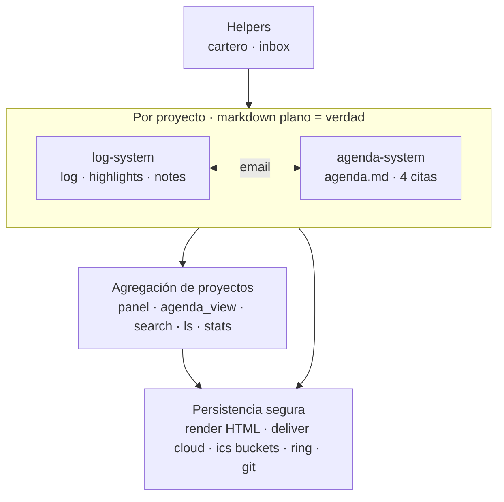

# MODULES.md

Mapa de módulos del paquete y sus dependencias internas. Sirve para guiar la limpieza/simplificación del CLI sin perder de vista qué encaja con qué.

Última auditoría: 2026-05-16 (post F1+F2+F3+F4 views refactor: render, doctor, cal y ring extraídos a `views/` como readers de la verdad). El subprocess al ring-daemon vive ahora en `views/ring/export.invoke_daemon`, y el bridge a cartero sigue en `core/cartero_invoke`. Total: ~37 módulos en `core/` + 4 paquetes en `views/` (`render`, `doctor`, `cal`, `ring`) + `orbit.py` (CLI) + 2 satélites (`satellites/ring-daemon/daemon.py`, `satellites/cartero/{daemon,google_oauth}.py`).

---

## 1. Vista esencial

Cuatro bloques. Acoplamientos:

- **`log-system` ↔ `agenda-system`** comparten una sola dependencia cruzada en escritura: `email.py` (captura email → entrada de log + opcional evento en agenda con `--ev`).
- Dentro de `log-system`, `highlights` y `notes` registran su operación llamando a `log.add_orbit_entry` — no son 100 % independientes entre sí.
- `cronograma` (Gantt) **vive aparte** de las 4 citas; encaja en log-system como md propio del proyecto pero su modelo es independiente.

---

## 2. Vista por capas (data flow detallado)

```mermaid
graph TB
    subgraph EXT_IN [Fuentes externas]
        MAIL[Mail.app · Outlook · .eml]
        SLACK[Slack]
        ICSIN[.ics externo]
    end
    subgraph EXT_OUT [Sinks externos]
        CALSUB[(Apple Calendar<br/>read-only subscriber)]
        REMAPP[(Reminders.app)]
        CLOUD[(OneDrive · GDrive)]
        NOTIF[(macOS Notifications)]
    end

    subgraph FEED [A · Feeds entrantes]
        cartero["satellites/cartero/daemon · 905"]
        email["email · 1098"]
        ics["ics · 771"]
        inbox["inbox · 290"]
    end

    subgraph TRUTH [B · md = verdad]
        log["log · 364"]
        highlights["highlights · 457"]
        notes["notes · 474"]
        agenda_cmds["agenda_cmds · 2245 ⚠️"]
        tasks["tasks · 318"]
        project["project · 631"]
        archive["archive · 328"]
        cronograma["cronograma · 1830 ❓"]
        tracked["tracked · 209"]
    end

    subgraph EMIT [C · Emisores salientes]
        render["render · 713"]
        deliver["deliver · 205"]
        cloudsync["cloudsync · 240"]
        cloud_imgs["cloud_imgs · 278"]
        ics_share["ics_share · 680"]
        ring_export["ring_export · 572"]
        ring["ring · 377 (helpers + dormant-flag path)"]
        daemon["satellites/ring-daemon/daemon · 288"]
        google_oauth["satellites/cartero/google_oauth · 73"]
    end

    subgraph VIEW [D · Vistas / dashboards]
        panel["panel · 433 → panel.md"]
        agenda_view["agenda_view · 1086 → agenda+cal"]
        project_view["project_view · 268"]
    end

    subgraph META [E · Búsqueda · meta]
        search["search · 231"]
        ls["ls · 135"]
        stats["stats · 468"]
        doctor["doctor · 758"]
        reorganize["reorganize · 344"]
    end

    subgraph FOUND [F · Foundation]
        config["config"]
        dateparse["dateparse"]
        opn["open"]
        hooks["hooks · 464"]
        commit["commit · 481"]
        startup["startup · 251 (carved from commit)"]
        shell["shell · 346"]
        claude["claude · 148"]
        clip["clip · 195"]
        history["history · 106"]
        undo["undo · 187"]
        setup["setup · 298"]
    end

    MAIL --> cartero --> NOTIF
    SLACK --> cartero
    MAIL --> email
    ICSIN --> ics

    email --> log
    email --> agenda_cmds
    inbox --> log
    ics --> agenda_cmds

    log --> notes
    log --> highlights
    project --> log
    agenda_cmds --> tasks
    archive --> log

    agenda_cmds --> ring_export --> daemon --> REMAPP
    agenda_cmds --> ring -.legacy.-> REMAPP
    agenda_cmds --> ics_share --> CLOUD --> CALSUB
    cartero --> google_oauth
    log --> render --> CLOUD
    log --> deliver --> CLOUD
    notes --> deliver
    cloudsync --> CLOUD
    cloud_imgs --> CLOUD

    log --> panel
    agenda_cmds --> panel
    agenda_cmds --> agenda_view
    project --> project_view

    log --> search
    project --> search
    log --> stats
    project --> ls

    commit --> hooks
    hooks --> ring_export
    hooks --> ics_share
    hooks --> render
```

⚠️ = monstruos (>1500 ℓ), candidatos a partir. ❓ = sospechosos de duplicidad o dormancia.

---

## 3. Outline conceptual → módulos reales

| Nº | Concepto | Módulos | Notas |
|---|---|---|---|
| 0.0 | Mail → log/event | `email` (1098) | Captura Apple Mail / Outlook / .eml. `--ev` también escribe agenda → cubre 2.1 a la vez. |
| 0.2 | Mail/Slack → notificación macOS | `cartero` (~905) | Globito nativo via `osascript`. Independiente del log. Indicador del prompt `[📬N]` retirado en F2 satellites (2026-05-15). |
| 1   | Log + hl + notes + cloud | `log` `highlights` `notes` + `archive` | `highlights` y `notes` escriben en `log` (no son independientes). |
| 1.1a | md propios en repo | `notes` | ✓ |
| 1.1b | pesados a cloud | `deliver` `cloudsync` `cloud_imgs` | 3 módulos para "copiar a `cloud_root`". Agrupados bajo `orbit cloud {deliver,sync,imgs}` en v0.38 (Fase 2). `recloud` (one-shot de migración) borrado. |
| 1.1c | links externos md / others | (convención de log; sin módulo dedicado) | Resuelto en `log` + `open`. |
| 1.3 | render HTML mirror | `render` (713) | ✓ |
| 2   | agenda.md (4 citas) | `agenda_cmds` (2245) `tasks` `agenda_view` (1086) | `agenda_cmds` es el corazón y el módulo más grande. |
| 2.1 | input email / ics | `email` `ics` | ✓ |
| 2.2.0 | dash → panel + agenda + calendar md | `panel` (panel.md) + `agenda_view` (agenda+cal) | ✓ |
| 2.2.1 | render HTML agenda | `render` | mismo módulo que 1.3 |
| 2.2.2 | .ics buckets + Calendar subscribe | `ics` `ics_share` + `hooks` | Calendar.app es solo subscriber (read-only) desde v0.33. |
| 2.2.3 | reminders → daemon → Reminders.app | `ring_export` `satellites/ring-daemon/daemon` (+ `ring` legacy dormante) | v0.37 con EventKit; daemon movido a `satellites/` en F1 satellites refactor (2026-05-15). `reminders.py` ya borrado (v0.38). |
| 3   | log + agenda en project | `project` `project_view` `search` `ls` `stats` | ✓ |
| 3.3.1 | Obsidian editor; md = verdad | (`editor` en `orbit.json`) | ✓ |

### Bloques que existen y no aparecían en el outline

| Bloque | Módulos | Decisión a tomar |
|---|---|---|
| Cronograma (Gantt + dependencias) | `cronograma` (1830) + `crono` CLI | ¿Fusionar con agenda, dejar aparte, congelar? |
| Captura rápida en `inbox.md` | `inbox` (290) | Encaja en (1) como input ligero. |
| Hooks + commit | `hooks` (464) + `commit` (707) + `hooks_catalog.json` | Foundation transversal que dispara los emisores. |
| Migraciones legacy | ~~`migrate` `tracked_migrate`~~ ✅ borrados (2026-05-15); quedan `reorganize` (344) `tracked` (209) | Auditar qué sigue vivo. |
| ~~Importador Evernote~~ | ~~`importer` (478)~~ | ✅ borrado (2026-05-15) |
| Meta CLI | `doctor` (758) `undo` (187) `history` (106) `setup` (298) `claude` (148) `clip` (195) `shell` (346) | Foundation, simplificable. |

---

## 4. Solapamientos y candidatos a simplificación

1. ~~**Tres caminos a Google/Calendar** — `gsync` (2880) + `calsync` (793) + `calendar_sync` (247). Según `DEPENDENCIES.md` Calendar.app es read-only subscriber desde v0.33. **Mayor potencial de borrado del repo.**~~ ✅ **Resuelto** (2026-05-15): `gsync`, `calsync` y `calendar_sync` borrados completos. Los OAuth helpers que cartero necesita viven en `core/google_oauth.py` (~75 ℓ). Total purgado del eje Google: 3920 ℓ.
2. ~~**Dos caminos a Reminders.app** — `reminders.py` (AppleScript directo, legacy) vs `ring_export+daemon` (EventKit, v0.35). `reminders.py` parece dormante.~~ ✅ **Resuelto** (2026-05-15): `reminders.py` borrado. Queda `ring.py` (520 ℓ) marcado como dormante en CLAUDE.md desde v0.37 — siguiente candidato.
3. ~~**Cuatro módulos cloud** — `deliver` + `cloudsync` + `recloud` + `cloud_imgs`.~~ ✅ **Resuelto** (2026-05-15, Fase 2): `recloud` borrado (one-shot de migración ya aplicado en todos los workspaces); los 3 restantes (`deliver`, `cloudsync`, `cloud_imgs`) viven intactos pero el CLI se agrupó bajo `orbit cloud {deliver,sync,imgs}`. La fusión a un único módulo se deja para Fase 4 (cuando se diseñe el seam `orbit/api.py`).
4. **`agenda_cmds.py` (2245 ℓ)** — mezcla CRUD de las 4 citas + parsing recurrencia + propagación. Candidato a partir en `agenda_io.py` + `recurrence.py` + `appointments/`.
5. **`cronograma.py` (1830 ℓ)** — orbita fuera del modelo de las 4 citas; convivencia o absorción es decisión de producto.

---

## 5. Plan de simplificación

Cuatro fases en este orden. **Cada fase debe dejar `pytest` verde antes de pasar a la siguiente** — los ~765 tests son el seguro de vida del refactor; si algo se rompe, se retrocede solo dentro de la fase actual.

| Fase | Qué | Beneficio esperado |
|---|---|---|
| **1 · Borrar** | Paths dormantes en `gsync.py`; `reminders.py` legacy si está superseded por `ring_export+daemon`; `migrate*` y `tracked_migrate` ya aplicados; `importer` si no se usa; lógica de hooks atrapada en `commit.py` extraída a `hooks.py` | **−4000 a −5000 ℓ**. Sin tocar interfaces de usuario |
| **2 · Mergear** | Cluster cloud: `deliver`+`cloudsync`+`cloud_imgs`+`recloud` → un solo `cloud.py` con subcomandos. Cluster calendar: lo que sobreviva tras Fase 1 absorbe al resto. Decisión sobre `cronograma`: absorber en agenda como quinto tipo o aislar | CLI con menos verbos top-level; mismo poder. **Estado**: cluster cloud agrupado en `orbit cloud {deliver,sync,imgs}` (2026-05-15, `recloud` borrado); cluster calendar y cronograma pendientes. |
| **3 · Reemplazar internals con libs estándar** | `icalendar` (PyPI) para producción/parseo ICS — sustituye hand-rolled en `ics`, `ics_share`, partes de `gsync`, `email._parse_ics`. `python-dateutil.rrule` para recurrencia — sustituye lógica hand-rolled en `agenda_cmds` y `ring`. **Aquí cae también la partición de monstruos** (`agenda_cmds.py` → `agenda/io.py` + `agenda/recurrence.py` + `agenda/{task,ms,ev,reminder}.py`) cuando sea prerrequisito | **−800 a −1200 ℓ adicionales**; menos edge cases de timezones / RRULE serialization |
| **4 · Simplificar API/CLI** | Convención `noun verb` por defecto (`orbit task add`, `orbit hl add`, `orbit cloud deliver`, `orbit ics share`). 3–4 atajos top-level por uso (`log`, `dash`, `commit`, `shell`). Seam estable `orbit/api.py`: funciones puras (`add_task(project, title, **kw) → Task`, etc.) que CLI, hooks y scripts externos llaman | `orbit.py` de 2296 ℓ → ~800 ℓ. CLI navegable por intuición, no por chuleta |

### Decisiones registradas en DECISIONS.md tras los cambios

- **Fase 3.A · icalendar adoptado** (2026-05-15, ADR-029): `icalendar` reemplaza la mecánica RFC 5545 hand-rolled en `ics`/`ics_share`/`email`. Bumpea deps pip de 2 a 3 (`+icalendar`, trae `python-dateutil` y `tzdata` como transitivas). Ahorro real: −110 ℓ netas + 17 tests de implementación.
- **Fase 3.B · python-dateutil promovido a directo** (2026-05-15, ADR-030): `relativedelta` + `rrule` reemplazan la aritmética manual de `_next_occurrence`. Coste real cero — ya estaba como transitiva de `icalendar`. Ahorro: −13 ℓ; los 12 tests de `TestNextOccurrence` (incluyendo el clamp 31-Jan → 28-Feb) pasan sin cambios.
- **Fase 3.C · `core/agenda_cmds.py` partido en subpaquete** (2026-05-15, ADR-031): 2202 ℓ → 6 módulos bajo `core/agenda/` (recurrence + io + display + lifecycle + runners + startup) + shim de 28 ℓ en el viejo path que preserva compat para los ~20 callers. Suite sin cambios. Reorganización, no consolidación.

### Orden táctico dentro de la Fase 1 (de menor superficie a mayor)

| # | Bloque | Tamaño aprox. | Acción | Estado |
|---|---|---|---|---|
| 1 | `reminders.py` (+ `tests/test_reminders.py`) | 190 + 318 | Borrar | ✅ 2026-05-15 (−508 ℓ, 1847 tests) |
| 2a | `ring.schedule_new_format_reminders` (no-op) + 2 helpers huérfanos + tests | ~250 | Borrar | ✅ 2026-05-15 (−252 ℓ, 1839 tests) |
| 2b | Resto de `ring.py` (path AppleScript-direct) | ~200 | **Desbloqueado** post-gsync. Pendiente de podar las ramas `not _agenda_via_calendar()` en `agenda_cmds.py` que ya son inalcanzables | pendiente (Fase 3) |
| 3 | `migrate` (548) `tracked_migrate` (179) `importer` (478) + CLI wiring + 4 tests | ~1325 | Borrar | ✅ 2026-05-15 (−1323 ℓ, 1835 tests) |
| 4 | `commit.py` carve-out de `startup_*` | extraer 226 | Nuevo `core/startup.py`. (Las 5 hook actions se quedan; revisitar tras paso 5) | ✅ 2026-05-15 (commit.py 707→481, suite verde) |
| 5 | `gsync.py` + `calsync.py` + 8 tests | −6826 ℓ borrados; +salvage de 3 helpers (`_new_orbit_id`, `_osa`, `_calendar_app_running`) a `ics`/`ics_share` | Borrar enteros (precondición `applescript_writes:false` cumplida en todos los workspaces) | ✅ 2026-05-15 (1567 tests verde) |

### Orden táctico dentro de la Fase 2

| # | Bloque | Tamaño aprox. | Acción | Estado |
|---|---|---|---|---|
| 1a | `recloud.py` (one-shot migración layout cloud) | 230 ℓ | Borrar (migración ya aplicada en todos los workspaces). Limpiar también `migrate`/`gsync` zombies en `shell.py:217 COMMANDS` | ✅ 2026-05-15 (−239 ℓ, 1567 tests) |
| 1b | CLI: agrupar `deliver`/`cloud imgs`/`cloudsync` bajo un solo verbo | +17/−5 ℓ orbit.py | Subcomandos `orbit cloud {deliver,sync,imgs}`. `orbit deliver` se mantiene como atajo top-level. Internals (`core/deliver.py`, `core/cloudsync.py`, `core/cloud_imgs.py`) intactos para no romper los ~30 callsites + mocks de tests; la fusión de internals queda para Fase 4 (seam `orbit/api.py`) | ✅ 2026-05-15 (1567 tests verde) |
| 2a | `calendar_sync.py` (~247 ℓ, mayormente dormante) | 247 ℓ | Partir: salvar OAuth helpers en `core/google_oauth.py` (~75 ℓ, cartero importa de ahí) + borrar resto + 3 clases de test (14 tests). Precondición original de "3 meses" acortada: el CLI llevaba dormante desde v0.33 (2026-05-12) y solo había 3 constantes consumidas | ✅ 2026-05-15 (−442 ℓ, 1553 tests) |
| 2b | Scripts zombie de gsync | 270 ℓ | `scripts/diagnose_calendar_sync.py` + `scripts/try_update_calendar_event.py` rotos desde v0.38 (importan `core.gsync` borrado) | ✅ 2026-05-15 (−270 ℓ, suite verde) |
| 3.1 | Cronograma como CLI `task crono` | +25/−54 ℓ orbit.py | Extraer helper `_add_crono_subparsers` (reusable). Montar `orbit task crono X` como forma canónica + `orbit crono X` como atajo. `cmd_task_new` delega a `cmd_crono` cuando `action=="crono"`. **Internals intactos** (test mocks, callers en agenda_view/panel/ics/doctor/commit no se tocan) | ✅ 2026-05-15 (1553 tests verde) |
| 3.2 | Vínculo modelo agenda↔cronos | — | **Pospuesto al final del plan** (decisión 2026-05-15): es diseño adicional al modelo task, no limpieza — conviene resolverlo tras Fase 3 y Fase 4 con el seam `orbit/api.py` estabilizado. Decisiones abiertas: ¿atributo `composite: <name>`? ¿done cascading? | pospuesto al final |
| 3.3 | Ejecución 3.2 + migración datos | — | Posiblemente migrar cronogramas existentes en los workspaces para crear la task-padre faltante en `agenda.md` | pospuesto al final |

### Orden táctico dentro de la Fase 3

| # | Bloque | Tamaño aprox. | Acción | Estado |
|---|---|---|---|---|
| A | `icalendar` (PyPI) reemplaza la mecánica RFC 5545 en `core/ics.py`, `core/ics_share.py`, `core/email._parse_ics` | 4 commits, −110 ℓ netas | Borrar 10 helpers RFC (`_escape`, `_fold`, `_fmt_dt_local`, `_fmt_date`, `_now_stamp`, `_alarm_block`, `_unfold`, `_unescape`, `_split_prop_line`, `_parse_dt`, `_parse_ics_dt`) y delegar a `icalendar.{Calendar,Event,Alarm}.to_ical()` / `Calendar.from_ical().walk("VEVENT")`. Firmas públicas mantenidas (callers en orbit.py/render.py/doctor.py no se enteran). Ver [ADR-029](DECISIONS.md#adr-029--migración-a-icalendar-pypi-para-mecánica-rfc-5545) | ✅ 2026-05-15 (commits `f63f7ac` + `5223dbd` + `40d4a93` + C4 docs, 1536 tests verde) |
| B | `python-dateutil` reemplaza la aritmética manual de `_next_occurrence` en `core/agenda_cmds.py` | 1 commit, −13 ℓ netas | `relativedelta(months=N)` para `monthly`/`every-N-months` (clamp natural). `rrule(DAILY, byweekday=MO..FR)` para `weekdays`. `rrule(MONTHLY, byweekday=X, bysetpos=±1)` para `first-X`/`last-X`. Firma `_next_occurrence(due, recur, done)` mantenida — 6 callers externos (ring, ring_export, agenda_view, ics, ics_share) intactos. Ver [ADR-030](DECISIONS.md#adr-030--migración-a-python-dateutil-para-la-mecánica-de-recurrencia) | ✅ 2026-05-15 (commit `e130c38`, 1536 tests verde) |
| C | Partir `core/agenda_cmds.py` (2202 ℓ) en subpaquete `core/agenda/` | 1 commit, +176 ℓ totales | 6 módulos (recurrence 140 + io 405 + display 212 + lifecycle 844 + runners 567 + startup 118) + `__init__.py` re-exporting + shim de 28 ℓ en `core/agenda_cmds.py`. Ningún caller externo modificado (la única limpieza colateral es `email.py` que importaba `resolve_file` de paso por agenda_cmds). El acoplamiento con cronograma 2.3.2 se difiere — partir con `composite=None` placeholder. Ver [ADR-031](DECISIONS.md#adr-031--partir-coreagenda_cmdspy-en-subpaquete-coreagenda) | ✅ 2026-05-15 (commit `1db9fba`, 1536 tests verde) |

### Orden táctico dentro de la Fase 4

| # | Bloque | Tamaño aprox. | Acción | Estado |
|---|---|---|---|---|
| A | Convención `noun verb` para el resto del CLI | 1 commit, +30 ℓ argparse | Promover `tracked add` / `tracked drop` a forma canónica + mantener `track` / `untrack` como atajos top-level (helpers `_add_track_args` / `_add_untrack_args` evitan duplicar la declaración). Patrón consolidado tras 2.1 (`cloud deliver`) y 2.3.1 (`task crono`). **`ics share` / `ics import` resuelto en 4.B** (argv rewrite en `_fix_argv`, no argparse subparsers) | ✅ 2026-05-15 (commit `e46931f`, 1536 tests verde) |
| B | Seam `core/api.py` + split parcial de `_build_parser` | 5 commits, +500 ℓ netas | `core/api.py` (~405 ℓ) con 10 funciones puras: 4 `add_*` + 2 `complete_*` + 4 `drop_*`. Cada una valida + raise ValueError, devuelve item dict. `_generic_add` se reescribe como wrapper CLI. `ics share` / `ics import` vía argv rewrite. Split parcial de `_build_parser` (helpers + agenda) a `core/parsers/` — orbit.py 2303 → 2072 ℓ. `edit_*`/`log_*` no entran en el API (80/20 sweet spot); refactor de `_generic_drop` queda como deuda. Path `core/api.py` (no `orbit/api.py`) por convención del repo. Ver [ADR-032](DECISIONS.md#adr-032--seam-coreapi--split-parcial-de-_build_parser) | ✅ 2026-05-15 (commits `6e3b464`+`2ad4c73`+`3ccf3e8`+`af7397f`+docs, 1536 tests verde) |

### Orden efectivo del plan tras la posposición de cronograma

Decidido 2026-05-15: **3.A ✅ → 3.B ✅ → 3.C ✅ → 4.A ✅ → 4.B ✅ → 2.3.2 → 2.3.3 → `api.add_task_composite`**.

### Único pendiente del plan

Cronograma 2.3.2 (diseño vínculo agenda↔cronos) + 2.3.3 (ejecución + migración) + `api.add_task_composite` como cierre. Ver [ADR-028](DECISIONS.md#adr-028--cronograma-como-task-compuesta-extensión-del-sistema-task).
