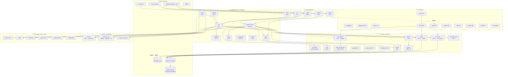

# Auditoría de módulos de Orbit · conversación

Fecha: 2026-05-15
Resultado: [`MODULES.md`](./MODULES.md) (en raíz del repo).
Glosario al final.

---

## JAngel

Buenos días, ¿puedes desde aquí acceder al repositorio de orbit que estará en repo/orbit?

## Claude

Buenos días. Sí, tengo acceso al repositorio en `/Users/hernando/work/software/orbit/repo/orbit/`. Veo que es un proyecto Python con git, que incluye `orbit.py`, `orbit_ring_daemon.py`, directorios `core/`, `tests/`, `scripts/`, y bastante documentación (`README.md`, `CLAUDE.md`, `CHANGELOG.md`, `ROADMAP.md`, etc.).

¿Qué quieres hacer con él?

---

## JAngel

Me gustaría identificar los módulos del paquete y sus dependencias, crear un grafo, y una vez los tengamos revisar cada módulo para limpiar y simplificar CLI. Tal y como lo veo:

- **0.0** lectura desde un servidor de correo (uso Mail) para añadir una entrada de log o evento.
- **0.2** lectura de Mail/Slack para determinar emails/notificaciones nuevas — escritura solo en el prompt (sin interferencia con el resto).
- **1** sistema de log (escritura en log, hl, notes y archivo en cloud): log y hl son independientes, solo (email).
  - **1.1** sistema de archivo de ficheros:
    - a) propios: md en el repo (notes), others (pesados) en cloud — definida GoogleDrive y OneDrive.
    - b) externos: md-links and others-links.
  - **1.3** Render in html (commit): crea estructura navegable de ficheros html — mirror del repo — de todos los ficheros propios y externos.
- **2** sistema de agenda (`agenda.md`) de citas categorizada en (eventos, task, ms, reminders).
  - **2.1** agenda puede recibir input de email (`email project --ev`) o de un ics.
  - **2.2.0** se crean vía dash (panel, agenda, calendar) md temporales para visualizar la agenda.
  - **2.2.1** agenda crea un render en html para el cloud.
  - **2.2.2** agenda crea —con commit, o por hooks (tocar un evento, dash, otros)— varios buckets `.ics` con los eventos. [El usuario se subscribe con Calendar].
  - **2.2.3** agenda crea —con hooks— un fichero de reminders que un daemon exporta a Reminders de Mac.

¿Puedes crear un grafo con esta estructura? Puedes revisarla para determinar las dependencias lógicas, si me he dejado algo en el tintero. Luego pasamos a mirar cada una, de la menor a la mayor.

- **3** el log y la agenda se juntan en project, con un sistema de search y de ls.
  - **3.3.1** los ficheros se visualizan vía Obsidian — son md — y son la verdad que el usuario puede editar.

## Claude

48 módulos en `core/` + `orbit.py` (2296 líneas, el CLI) + daemon. ~28k líneas. Tras mapear las dependencias entre módulos y los comandos del CLI:

### 1) Diagrama de subsistemas (vista layered)

⚠️ = monstruosos / candidatos a partir. ❓ = sospechosos de duplicidad o dormancia.

### 2) Tu outline → módulos reales

| Tu nº | Concepto | Módulos reales | Notas |
|---|---|---|---|
| **0.0** | Mail → log/event | `email.py` (1098 ℓ) | Cubre captura de Apple Mail/Outlook/.eml. `--ev` también escribe en agenda → cubre 2.1 a la vez |
| **0.2** | Mail/Slack → notif. al prompt | `cartero.py` (958 ℓ) | Solo escribe `[📬N]` en el shell. Independiente del log. ✓ |
| **1** | Log + hl + notes + cloud | `log` `highlights` `notes` + `archive` | ⚠️ matiz: `highlights` y `notes` **no son independientes** de `log` — ambos llaman a `log.add_orbit_entry`. Si los quieres independientes hay que romper esa dependencia |
| **1.1a** | md propios en repo | `notes.py` | ✓ |
| **1.1b** | pesados a cloud | `deliver` `cloudsync` `cloud_imgs` `recloud` | Cuatro módulos para una sola idea (entrega a nube). Candidato a fusión |
| **1.1c** | links externos md / others | (convención de log; sin módulo dedicado) | El link externo se resuelve en `log` + `open` |
| **1.3** | render HTML mirror | `render.py` | ✓ |
| **2** | agenda.md (4 citas) | `agenda_cmds.py` (2245 ℓ) `tasks.py` `agenda_view.py` | `agenda_cmds` es el módulo más grande del repo — es el corazón |
| **2.1** | input email / ics | `email.py` `ics.py` | ✓ |
| **2.2.0** | dash → panel/agenda/calendar md | `panel.py` (panel.md) + `agenda_view.py` (agenda+cal) | ✓ |
| **2.2.1** | render HTML agenda | `render.py` | mismo que 1.3 |
| **2.2.2** | .ics buckets + Calendar subscribe | `ics.py` `ics_share.py` + `hooks.py` | ✓ Calendar.app es solo subscriber según `DEPENDENCIES.md` |
| **2.2.3** | reminders → daemon → Reminders.app | `ring.py` `ring_export.py` `orbit_ring_daemon.py` (+ `reminders.py` legacy) | v0.35 ya está hecho con EventKit. `reminders.py` antiguo puede ser dormante |
| **3** | log + agenda en project | `project.py` `project_view.py` `search.py` `ls.py` `stats.py` | ✓ |
| **3.3.1** | Obsidian = editor; md = verdad | (config: `editor` en `orbit.json`) | ✓ |

### 3) Lo que se te ha quedado en el tintero (existe en el repo)

| Bloque | Módulos | Qué hace | Decisión a tomar |
|---|---|---|---|
| **Cronograma** | `cronograma.py` (1830 ℓ) + `crono` CLI | Gantt y tareas con dependencias, separado de `agenda.md` | ¿Fusionar con agenda, mantener aparte, o congelar? |
| **Inbox rápido** | `inbox.py` (290 ℓ) | Línea suelta en `inbox.md` → orbit dispatch a logbook | Encaja en (1) como input ligero |
| **Hooks + commit** | `hooks.py` (464 ℓ) `commit.py` (707 ℓ) `hooks_catalog.json` | Disparadores que tu outline asume (commit, tocar evento…) | Foundation transversal, no es un "bloque" pero hay que documentarlo |
| **Doctor / migrate / reorganize / tracked / undo / history / importer** | ~2200 ℓ entre todos | Diagnóstico, migraciones legacy, tracking de ficheros, undo, importador Evernote | Candidatos a auditoría (¿qué sigue vivo?) |
| **Shell + claude + setup + clip + open** | ~1100 ℓ | REPL host, integración Claude, wizard, clipboard, abrir ficheros | Foundation, simplificable |

### 4) Solapamientos reales (objetivos claros de simplificación)

1. **Tres caminos a Google/Calendar**: `gsync.py` (2880 ℓ), `calsync.py` (793), `calendar_sync.py` (247). Según `DEPENDENCIES.md` Calendar.app ya es read-only subscriber desde v0.33. Probable que >50 % de `gsync` esté dormante. **Mayor oportunidad de borrado masivo**.
2. **Dos caminos a Reminders.app**: `reminders.py` (AppleScript directo, legacy) vs `ring_export+daemon` (EventKit, v0.35). `reminders.py` parece dormante.
3. **Cuatro módulos cloud**: `deliver` `cloudsync` `recloud` `cloud_imgs` — todos giran sobre "copiar fichero a `cloud_root`". Fusionables.
4. **`agenda_cmds.py` (2245 ℓ)**: mezcla CRUD de las 4 citas + parsing recurrencia + propagación. Candidato a partir en `agenda_io.py` + `recurrence.py` + `appointments/`.
5. **`cronograma.py` (1830 ℓ)** orbita fuera del modelo de las 4 citas — convivencia o absorción es decisión de producto.

### 5) Orden propuesto (de menor a mayor)

| # | Módulo / bloque | Tamaño | Por qué empezar aquí |
|---|---|---|---|
| 1 | `history` (106) `ls` (135) `claude` (148) `open` (117) | <500 | Calentamiento, baja superficie |
| 2 | `reminders.py` (190) | 190 | Verificar si es enteramente dormante → posible borrado |
| 3 | `inbox` `clip` `archive` `recloud` | ~1000 | Bloques pequeños y aislados |
| 4 | Cluster cloud (`deliver`+`cloudsync`+`cloud_imgs`+`recloud`) | ~950 | Fusión y simplificación CLI |
| 5 | `cartero` (958) | 958 | Subsistema 0.2 completo |
| 6 | `email` (1098) | 1098 | Subsistema 0.0 + entrada a 2.1 |
| 7 | `render` (713) + `ics_share` (680) + `ics` (771) | ~2200 | Emisores: HTML + .ics |
| 8 | `ring` (520) + `ring_export` (572) + `daemon` (288) | ~1380 | Cadena 2.2.3 (ya en v0.35) |
| 9 | `cronograma` (1830) | 1830 | Decisión estratégica |
| 10 | **`gsync` + `calsync` + `calendar_sync`** | ~3920 | Mayor potencial de borrado |
| 11 | `agenda_cmds` (2245) | 2245 | El núcleo, último para no romper nada antes |

---

## JAngel

Crea un md de `MODULES.md` y pon el grafo. Pero la vista desde arriba es esencialmente: log-system + agenda-system per project y aggregation of projects, con escasas dependencias, más algunos helpers (cartero), y seguridad (render in cloud in html, git), ¿correcto? Prepara el grafo y vamos revisando cada una.

## Claude

Sí, tu vista de arriba es correcta — con dos matizaciones:

1. **`log-system` ↔ `agenda-system` casi independientes**, pero cruzan en un solo punto de escritura: `email.py` (un email puede generar a la vez una entrada de log y un evento en agenda).
2. **Dentro del log-system**, `highlights` y `notes` llaman a `log.add_orbit_entry` para dejar rastro — no son 100 % independientes del log; son co-ciudadanos.

→ Resultado: [`MODULES.md`](./MODULES.md) creado en la raíz del repo con (§1) la vista esencial de 4 bloques, (§2) la vista detallada por capas, (§3) mapping outline → módulos, (§4) solapamientos, (§5) orden de revisión.

---

## JAngel

Gracias Claude, tu opinión al respecto, cosas buenas y malas. Recuerda que Orbit ha crecido con el tiempo y ha tenido pasos atrás y adelante. Esta estructura lo refleja, pero me gustaría ahora que el uso es más claro, poner orden. Intentar desacoplar dependencias y simplificar las interfaces CLI.

## Claude

Te lo doy sin filtros.

### Lo bueno — y es bastante

1. **La decisión foundational acierta**: markdown plano como verdad, git como backbone, Obsidian como editor. Eso envejece bien. La mayoría de "personal knowledge tools" llevan al usuario a un walled garden propietario; tú no.
2. **Locality por proyecto**: log + agenda + notes + cronograma viven en la carpeta del proyecto. Modelo mental trivial — "lo de mi proyecto está en la carpeta de mi proyecto". Cuando borras una carpeta, desaparece todo lo del proyecto. Eso es oro.
3. **Separación código (público) / workspaces (privado)** con cloud sync — limpia, pensada.
4. **Las 4 citas uniformes** (task/ms/ev/reminder con `add`/`drop`/`edit`/`list`/`log`) es buen diseño de API. Reduces N interfaces a 1.
5. **El refactor del ring (v0.35)** es exactamente el tipo de movida arquitectónica correcta: pasaste de AppleScript-directo enterrado en `gsync.py` a un contrato de datos explícito (`ring.json`) + un backend reemplazable (daemon EventKit). Observable, testable, sustituible.
6. **Calendar.app read-only subscriber (v0.33)** — eliminar la bidireccionalidad fue una decisión mayor y correcta. Sin sync conflicts, una sola dirección de verdad.
7. **HTML mirror al cloud** como escape hatch — puedes leer todo desde el móvil sin orbit instalado. Eso es resiliencia, no feature.
8. **~765 tests, CHANGELOG vivo, DECISIONS.md, DEPENDENCIES.md**. Disciplina de documentación rara en proyectos personales. Eso es lo que ha permitido que el código creciera sin colapsar.
9. **`config.py` como raíz de dependencias**, todo cuelga de él. Topología sana.

### Lo malo — específico, ordenado por gravedad

1. **Acreción visible en clusters duplicados**. Tres caminos a Google/Calendar (`gsync` 2880 + `calsync` 793 + `calendar_sync` 247 = 3920 ℓ) y dos a Reminders (`reminders` legacy vs `ring_export+daemon`). Cada vez que reescribiste, no borraste el anterior. Esto es lo más caro: cualquier cambio futuro tiene que considerar tres implementaciones, dos de las cuales probablemente ya nadie usa. Es la mayor fuente de dificultad para entender el repo desde fuera.
2. **`agenda_cmds.py` a 2245 líneas**. Es el corazón del agenda-system y mezcla CRUD + parsing de recurrencia + propagación + manipulación de líneas md. Cada toque arriesga romper algo no relacionado. El test suite te protege, pero el coste cognitivo es alto.
3. **`gsync.py` a 2880 líneas con paths dormantes**. Tu propio `DEPENDENCIES.md` dice que el AppleScript-direct quedó dormante en v0.33. ¿Cuánto de esos 2880 sigue ejecutándose? Mientras no lo sepas, son 2880 líneas que cualquier futuro Claude (o tú dentro de 6 meses) tiene que leer y descartar mentalmente.
4. **`commit.py` a 707 líneas para envolver `git commit`** — sospechoso. Probablemente arrastra lógica de hooks pre/post que debería vivir en `hooks.py`. Mezcla de responsabilidades.
5. **CLI sin convención uniforme**. Conviven `orbit task add` (noun-verb), `orbit log "msg"` (verbo plano), `orbit ics-share` (kebab), `orbit ics share` (subcommand), `orbit hl add` (abreviado), `orbit reminder add` aliased `rem`. Discoverable a base de leer la chuleta, no por intuición. Para un usuario solo (tú) es viable; para reducir carga cognitiva propia, no.
6. **Sin seam clara entre core y CLI**. `orbit.py` importa `run_X` de cada módulo; cada módulo exporta `run_X` para el CLI. Eso acopla el contrato de cada módulo a su forma de invocación CLI. Si quisieras programáticamente usar orbit (cron, otro script), no hay un API limpio — tienes que llamar `run_X(args_namespace)`.
7. **State files dispersos en la raíz** (`.cartero-state.json`, `.journal.jsonl`, `.reminders/`, `.last_ring`, `.dash-stamp`, `.cloud-sync.json`, `calendar-sync.json`, `google-sync.json`). Algunos hidden, otros no. Falta convención: probablemente todo state debería ir bajo `.orbit-state/`.
8. **Migraciones legacy como módulos core** (`migrate` + `tracked_migrate` + `reorganize` + posiblemente `importer`). Una vez ejecutadas en todos tus workspaces, son código muerto que se sigue importando.
9. **`cronograma.py` (1830) orbita fuera del modelo** de las 4 citas. No es malo per se, pero es un quinto "tipo" mental que el usuario tiene que recordar y que duplica patrones (gantt, dependencias, reindex). Decisión pendiente: absorber en agenda o aislar mejor.
10. **Múltiples views haciendo cosas parecidas**: `panel.md`, `agenda.md` (efímero), `calendar.md`, `dash`, terminal-render de `agenda_view`/`project_view`/`ls`/`search`. Cada uno con su lógica de formateo. Probablemente unificable en 2 o 3 patrones.

### Recomendación estratégica

Tres fases, en este orden, **delete → merge → split**:

**Fase 1 · Borrar (mayor ROI por línea borrada)**
- Confirmar y borrar paths dormantes en `gsync.py` — apunta a llevarlo a ≤500 ℓ.
- Confirmar y borrar `reminders.py` si está superseded por `ring_export+daemon`.
- Mover `migrate*.py`, `tracked_migrate.py`, `importer.py` a `scripts/` (ya tienes esa carpeta) o borrarlos si están aplicados en todos los workspaces.
- Auditar `commit.py` — extraer hook logic a `hooks.py`.

Beneficio esperado: −4000 a −5000 líneas. **Sin tocar interfaces de usuario**.

**Fase 2 · Fusionar (clusters duplicados)**
- `deliver` + `cloudsync` + `cloud_imgs` + `recloud` → un solo `cloud.py` con subcomandos. CLI: `orbit cloud {deliver,sync,imgs,relink}`.
- `calsync` + `calendar_sync` → cualquiera que sobreviva tras la fase 1 absorbe al otro.
- Decisión sobre `cronograma`: o se absorbe en agenda como un quinto tipo (con su sub-CLI), o se le da carpeta propia y deja de fingir que es par del log/agenda.

Beneficio esperado: CLI con menos verbos top-level, mismo poder.

**Fase 3 · Partir (los monstruos)**
- `agenda_cmds.py` → `agenda/io.py` + `agenda/recurrence.py` + `agenda/{task,ms,ev,reminder}.py`. Cada archivo ≤500 ℓ y testeable en aislamiento.
- Definir un seam `orbit/api.py`: funciones puras `add_task(project, title, **kw) → Task`, `list_tasks(project, filter) → [Task]`, etc. El CLI llama esto; los hooks llaman esto; un futuro script o REPL llama esto. `orbit.py` queda solo como argparse + formateo.

Beneficio esperado: cualquier feature futura toca un archivo pequeño.

**Y para la CLI**:
- Una convención: `orbit <noun> <verb>` por defecto. Mantener 3-4 verbos top-level por uso (`log`, `dash`, `commit`, `shell`) como atajos documentados.
- Eso reduce el `orbit.py` de 2296 ℓ a probablemente ~800 ℓ (boilerplate argparse).

### Síntesis

El problema no es que orbit esté mal diseñado — está bien diseñado en lo grande (markdown + git + locality + 4-citas uniforme + ring desacoplado). El problema es que las decisiones correctas más recientes no fueron acompañadas del borrado del código que reemplazaban. **La acreción es la deuda.** Borrar es lo más rentable que puedes hacer ahora — y es lo más fácil porque tienes tests para protegerte.

---

# Glosario

Términos que aparecen en la conversación o que conviene tener a mano para futuras revisiones.

| Término | Significado |
|---|---|
| **API** | *Application Programming Interface*. Conjunto de funciones que un módulo expone para que otro lo llame. En orbit: si extrajéramos `orbit/api.py`, sería el conjunto de funciones que tanto la CLI como los hooks como cualquier script externo podrían usar sin reimplementar nada. |
| **AppleScript** | Lenguaje de automatización de macOS para "hablar" con apps (Mail, Calendar, Reminders…) desde shell. orbit lo usa vía `osascript`. |
| **argparse** | Librería estándar de Python para parsear argumentos de línea de comandos. Es lo que define que `orbit log "hola"` tenga la forma que tiene y no otra. |
| **backbone** | Columna vertebral. Cuando digo "git como backbone": git es la base sobre la que descansa todo (versionado, historial, recuperación). |
| **backend** | Implementación interna de un servicio, oculta tras una interfaz. Ej: el backend de captura de email puede ser Mail.app, Outlook o `.eml` — el frontend (`orbit email`) es el mismo. |
| **boilerplate** | Código repetitivo necesario pero sin valor conceptual. Las 80 declaraciones `subparsers.add_parser(...)` en `orbit.py` son boilerplate. |
| **CLI** | *Command Line Interface*. Interfaz de línea de comandos. La forma de usar orbit que se invoca desde el terminal (`orbit ...`). |
| **contract / data contract** | Acuerdo explícito sobre el formato de un dato compartido. `ring.json` es un data contract entre orbit y el daemon: ambos saben qué campos esperar. |
| **coupling / acoplamiento** | Grado en que un módulo depende de otro. **Desacoplar** = reducir esa dependencia para que los cambios en uno no obliguen a tocar el otro. |
| **CRUD** | *Create, Read, Update, Delete*. Las 4 operaciones básicas sobre datos. "CRUD de las 4 citas" = `add` (create), `list` (read), `edit` (update), `drop` (delete). |
| **daemon** | Proceso que corre en segundo plano de forma persistente. `orbit_ring_daemon.py` corre escuchando cambios en `ring.json` y propagándolos a Reminders.app. |
| **dispatcher** | Pieza de código que recibe una entrada y decide qué función llamar para procesarla. `orbit.py` es un dispatcher: lee `argv` y llama al `run_X` del módulo apropiado. |
| **dormant code · código dormante** | Código que sigue presente en el repo pero ya no se ejecuta (o solo se ejecuta en paths que ya nadie usa). Lastre invisible. |
| **escape hatch** | Salida de emergencia. El render HTML al cloud es un escape hatch: aunque orbit desaparezca, los `.html` siguen siendo legibles desde cualquier dispositivo. |
| **EventKit** | Framework nativo de macOS/iOS para acceder a Calendar y Reminders programáticamente. Más fiable que AppleScript para Reminders. |
| **foundation · foundational** | Base. Módulos foundational son los que todos los demás importan (`config`, `dateparse`). |
| **frontmatter** | Cabecera YAML al principio de un `.md` (entre dos `---`). Sirve para meta-datos. Lo usan Obsidian, Jekyll, Hugo, etc. |
| **hook** | Gancho. Función que se dispara automáticamente ante un evento (commit, edición de fichero, etc.). `core/hooks.py` define los hooks de orbit. |
| **ICS · `.ics`** | Formato estándar (iCalendar / RFC 5545) para representar eventos de calendario. Calendar.app puede suscribirse a una URL `.ics`. |
| **layered · por capas** | Organización en niveles donde cada capa solo depende de la inferior. La vista §2 de `MODULES.md` es layered. |
| **legacy** | Heredado. Código de versiones previas que sigue ahí. No es necesariamente malo, pero suele ser candidato a borrado o reemplazo. |
| **locality** | Cercanía. "Locality por proyecto" = lo que pertenece al proyecto vive en su carpeta, no disperso por el sistema. |
| **markdown · md** | Lenguaje ligero de marcado para texto plano legible. Lo que usa Obsidian, GitHub, etc. |
| **mirror** | Réplica idéntica. "HTML mirror" = una réplica del repo en HTML que vive en el cloud. |
| **monolithic · monstruo** | Módulo desproporcionadamente grande que mezcla muchas responsabilidades. En orbit: `agenda_cmds` (2245 ℓ), `gsync` (2880 ℓ). |
| **noun-verb pattern** | Patrón sustantivo-verbo en CLI: `orbit task add` (noun=task, verb=add). Alternativa: verb-noun (`orbit add task`). Lo importante es elegir uno y mantenerlo. |
| **path · code path** | Camino de ejecución. "Path dormante" = una ruta de código que ya no se recorre en uso normal. |
| **pytest** | Framework de tests más usado en Python. orbit tiene ~765 tests bajo `tests/`. |
| **read-only** | Solo lectura. "Calendar.app es read-only subscriber" = solo lee los `.ics` que orbit emite, no escribe en ellos. |
| **repo · repositorio** | Carpeta versionada con git. |
| **REPL** | *Read-Eval-Print Loop*. Bucle interactivo. `orbit shell` es un REPL. |
| **ROI** | *Return On Investment*. Retorno de la inversión. "Mayor ROI por línea borrada" = el esfuerzo que más resultado da por unidad de trabajo. |
| **seam** | Costura, junta. Punto definido donde dos partes del sistema se acoplan de forma intencional para poder reemplazar una sin tocar la otra. |
| **shell** | Intérprete de comandos. zsh, bash, o el `orbit shell` interno. |
| **sidecar** | Componente que corre junto al sistema principal sin formar parte de su pipeline. cartero es un sidecar respecto al log-system: notifica, pero no escribe en log. |
| **subcommand · subparser** | Comando anidado dentro de otro. En `orbit task add`, `add` es subcommand de `task`. |
| **subprocess** | Módulo de Python que invoca otros procesos (ej: llamar a `git`, a `osascript`). |
| **subscribe (Calendar)** | Suscribirse a una URL `.ics`. La app actualiza el calendario periódicamente leyendo esa URL. |
| **subsystem · subsistema** | Bloque coherente que cumple una función dentro del sistema mayor. Log-system y agenda-system son subsistemas. |
| **topology · topología** | Forma de las dependencias entre módulos vista como grafo. "Topología sana" = sin ciclos, con foundation clara. |
| **walled garden** | Jardín amurallado. Sistema cerrado que dificulta sacar tus datos. Notion, Evernote son walled gardens; orbit (md+git) es lo opuesto. |
| **workspace** | Carpeta de trabajo independiente. `orbit-ws` (trabajo) y `orbit-ps` (personal) son dos workspaces. |
